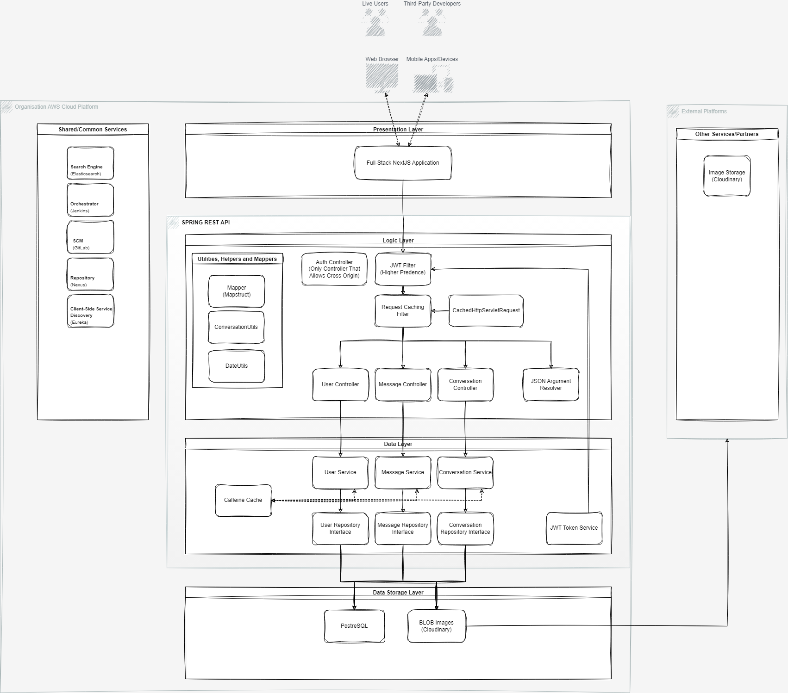
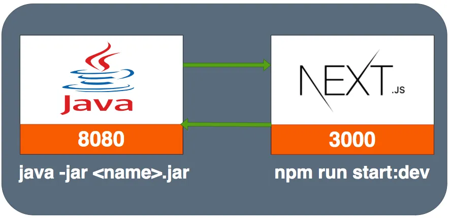
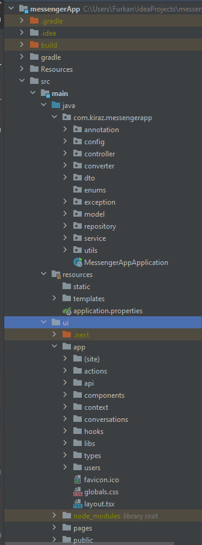
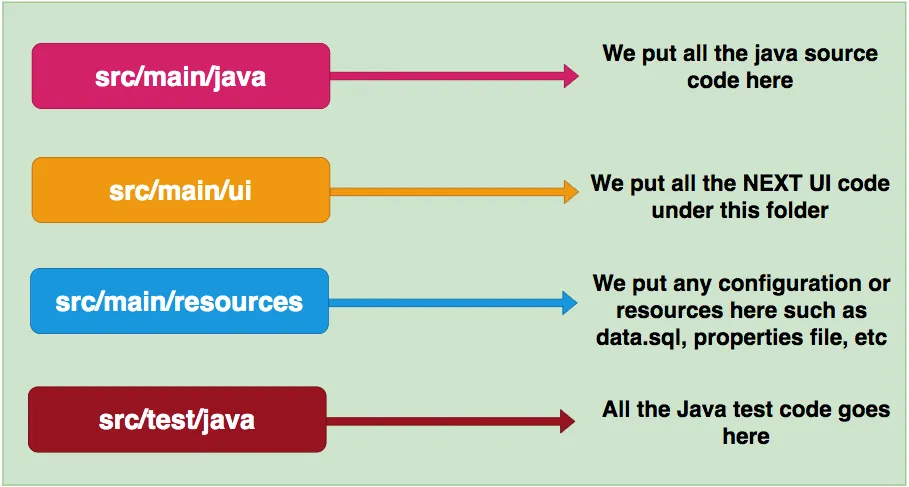

# Clone Messaging Application

## Table of contents
* [Introduction](#introduction)
* [Project Overview](#project-overview)
* [Technologies Used](#technologies-used)
* [Key Features](#key-features)
* [Installation and Usage](#installation-and-usage)
* [Internal Structure and Diagrams](#internal-structure-and-diagrams)

## Introduction
This project showcases my Java-Spring Boot and React capabilities as a newly graduated software engineer and full-stack (mainly back-end) Java developer. The goal of this project is to develop a clone messaging application that adheres to SOLID concepts, clean code standards, and production-grade requirements.
 
## Project Overview

The Clone Messaging Application consists of two subprojects:

1. **_Front-End:_** A **_Full-Stack React based Next.js_** project that handles the user interface and client-side functionality of the messaging application.
2. **_Back-End:_** A **_Spring Boot based RESTful API_** that provides the necessary server-side functionality for the messaging application with the power of **PostreSQL**.

Some features on diagram will be added later.

[Link to Draw.io File](Resources/diagram.drawio)

## Technologies Used

* **_Front-End:_** React, Next.js, Tailwind, Javascript, Axios, Next-Auth
* **_Back-End:_** Java, Spring Boot, Hibernate, Lombok, PostreSQL, RESTful API

## Key Features

1. **_User Registration:_** Users can create accounts and securely register themselves.
2. **_Authentication and Authorization:_** Secure authentication and authorization mechanisms are implemented to ensure data privacy and user access control.
3. **_Messaging Functionality:_** Users can send and receive messages, create chat groups, and manage their conversations.
4. **_Real-time Updates:_** The application incorporates real-time updates to provide instant notifications and message synchronization.

## Installation and Usage

To run the Clone Messaging Application locally, follow these steps:

1. Clone this repository: `git clone https://github.com/Opersan/messengerApp.git`

2. Install dependencies for the Front-End project: `cd src/main/ui && npm install`

3. Start the Front-End server: `npm run dev`
4. Install dependencies for the Spring Boot project by using Gradle.
5. Start the Back-End server: `cd ../../.. && ./gradlew bootRun`

Once the servers are up and running, you can access the application by navigating to `http://localhost:3000` in your web browser.

## Internal Structure and Diagrams

## Future Works
1. [ ] Caffeine Cache feature will be added.
2. [ ] All internal api system will be converted to microservice structure.
3. [ ] After transition processes, DevOps logic will be adopted and GitOPS tools will be used.
4. [ ] Client-side Service Discovery (Spring Cloud Netflix Eureka) feature will be added.
5. [ ] Deployment and DevOPS architecture diagram should be drawn.
6. [ ] IOS Bitmoji integration will be considered.
7. [ ] Load and mock tests will be implemented and results will be shared here.
8. [ ] Examine and find out if Apache Kafka logic is applicable after transition

## API Endpoints

## Security
Strict-Transport-Security and Https only for sensitive payloads.

